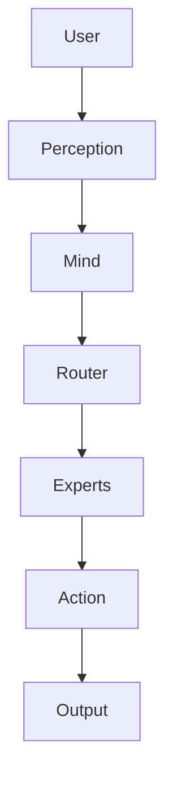

# MX2LM

MX2LM now includes a **Supernaut architecture scaffold** merged into the repo.

## MX2LM (PowerShell stack)

Mixture of Trinity Experts where each expert is:
- **K'UHUL** runtime kernel
- **PowerShell** orchestration
- **XJSON** manifest contracts

Files:
- `moe-manifest.xjson`
- `Kuhul.psm1`
- `MX2LM-Expert.psm1`
- `MX2LM-Router.psm1`
- `MX2LM.psm1`

## Supernaut (Python stack)

A layered system scaffold aligned to the blueprint:
- `supernaut/core`: neural/symbolic/quantum substrate + MX2LM manifest loading
- `supernaut/consciousness`: thought + intention loop
- `supernaut/memory`: episodic/semantic/working memory placeholders
- `supernaut/perception`: modality integration placeholder
- `supernaut/action`: code/explanation/test output synthesis
- `supernaut/evolution`: iterative adaptation placeholder
- `supernaut/micronauts`: body activation placeholder
- `supernaut/system.py`: unified `Supernaut` class
- `supernaut/api.py`: optional FastAPI app factory

## Quick start (Python)

```bash
python - <<'PY'
from supernaut import Supernaut
s = Supernaut()
print(s.awaken())
print(s.query("Write a fibonacci function"))
PY
```

## Quick tests

```bash
python -m unittest -v
```


## Living architecture diagram

The architecture diagram is maintained in `docs/ARCHITECTURE.md` and should be updated whenever any module boundary, data flow, or routing strategy changes.

Quick view:


