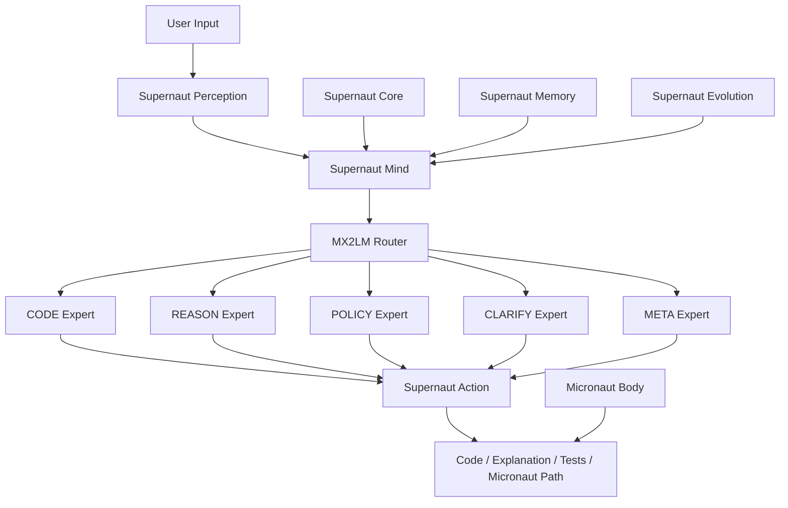
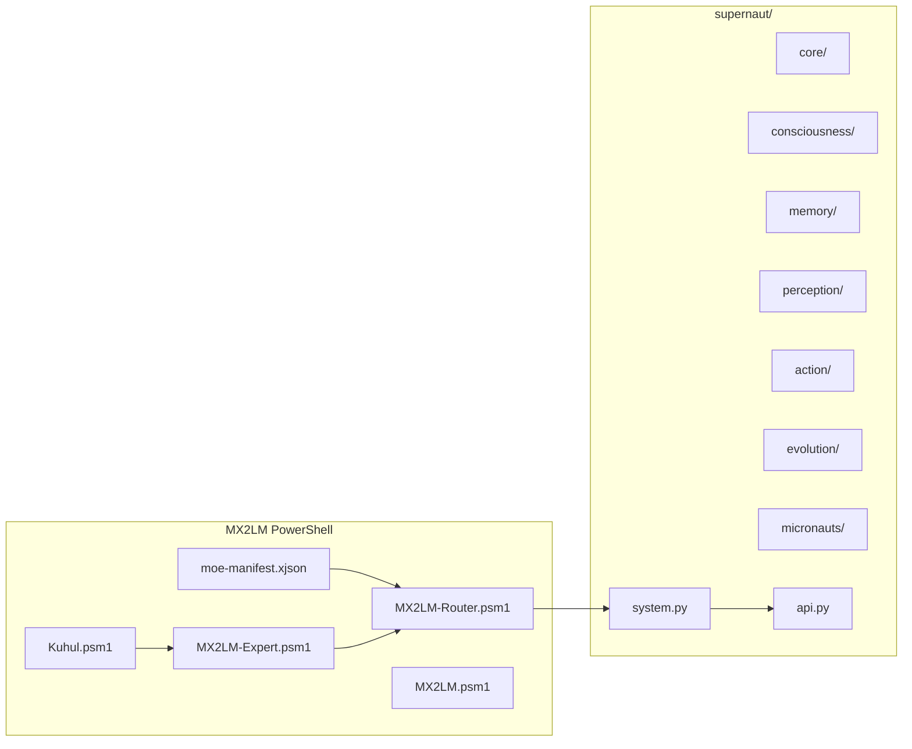
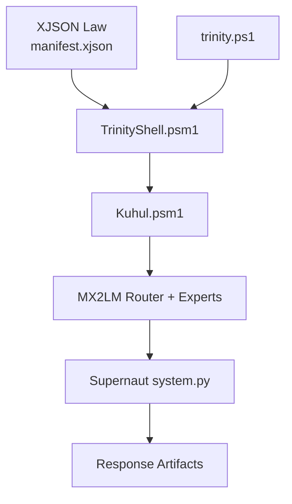

# MX2LM + Supernaut Architecture Diagram

This document is the **living architecture diagram** for the repository.
Update this file whenever routing, layers, or interfaces change.

## System Overview

## Layered Blueprint (Directory Mapping)

## Diagram Update Log

- 2026-02-24: Initial living diagram added for merged MX2LM + Supernaut repository.
- 2026-02-24: Trinity runtime flow diagram added and linked to new shell/launcher files.

## How to update as we go

1. Update one or both Mermaid diagrams when topology changes.
2. Add one bullet to **Diagram Update Log** with date + summary.
3. If behavior changed, run tests and include command output in PR notes.

## Trinity runtime flow (updated)

