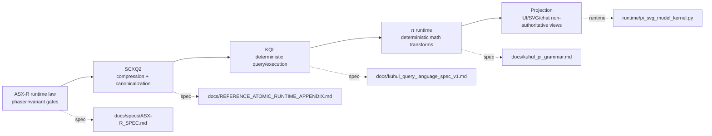

# Quick-Start: End-to-End Symbolic Flow

This diagram shows the canonical runtime path:

`ASX-R → SCXQ2 → KQL → π → projection`

## Flow Notes

1. **ASX-R phase gates** validate legal transitions before any computation executes.
2. **SCXQ2** converts payloads to canonical compressed symbolic forms.
3. **KQL** performs deterministic data retrieval/manipulation over runtime stores.
4. **π** computes deterministic transforms (vectors, entropy, scoring, geometry).
5. **Projection** renders artifacts (SVG/UI/chat) as views of already-sealed state.

See also:
- `scripts/reference/validate_phase_gating.mjs`
- `scripts/reference/validate_compression_invariants.mjs`
